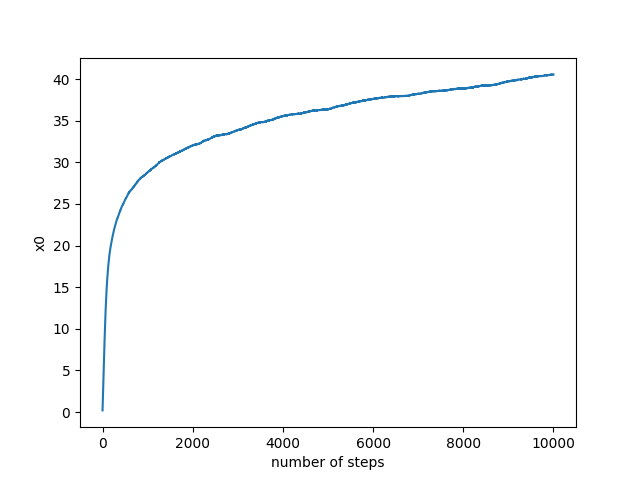
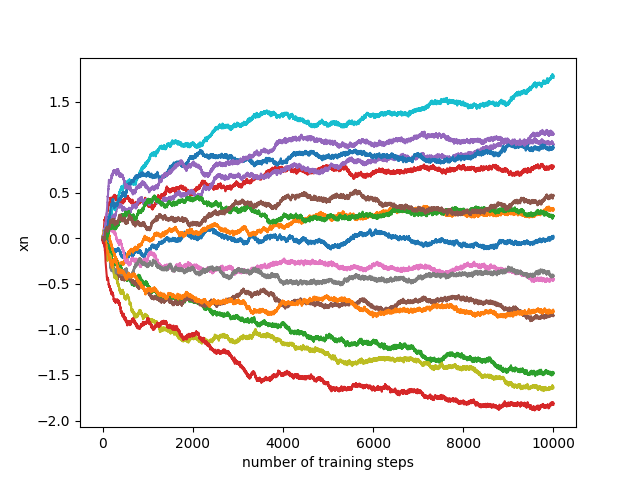

## Tessellating Hills

Fork of the code for DaemonicSigil's awesome [post](https://www.lesswrong.com/posts/X7S3u5E4KktLp7gHz/tessellating-hills-a-toy-model-for-demons-in-imperfect) on demons in imperfect search. Primarily modified to run on higher dimensions, because it's [harder to fall into local minima in high dimensions](https://www.lesswrong.com/posts/X7S3u5E4KktLp7gHz/tessellating-hills-a-toy-model-for-demons-in-imperfect?commentId=A4hDCPbAuJQ6SZ6Pt).

My brief experiments were somewhat inconclusive. Here's some graphs for 1k dimensions and 10k steps (same hparams for the rest)

